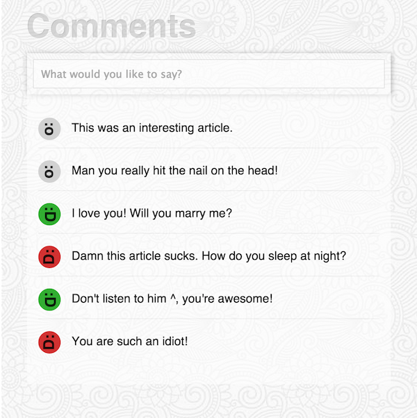

# react-lessons
Simple to complex react concepts... Wherein we learn React by building a commenting system that automatically attaches emojis to each comment based on the comment's [sentiment](https://www.mashape.com/vivekn/sentiment-3). 

# Exploring this Repo

- Clone the repo
- `npm install`
- Then either `gulp watch`
- Or `gulp watch01`, or `gulp watch02`, etc...
- Navigate to [http://localhost:4444/public](http://localhost:4444/public)

# Messing around

If `gulp watch` is running, you can open [http://localhost:4444/public](http://localhost:4444/public) and then edit any `app.js` file and the web page will auto-reload whenever you click *save* (so long as syntax errors don't cause compilation to fail).

# Topics Covered

### `01` Creating Components
#### (aka Elements... aka the artist formerly known as Component)

### `02` events, state, refs, getDOMNode()

### `03` Creating Sub-components

### `04` Top-down State

### `05` Creating a list component

### `06` Introducing basic Flux concepts

### `07` Wiring up Flux

### `08` Introduction to `immutable.js` and `morearty.js`

### `09` Refactor application to use Morearty and Immutable Data

### `10` Adding an asyc network request (with `superagent.js`) to the Action Creator

### `11` Spruce things up with classes, placeholder, remove pre-filled comments
